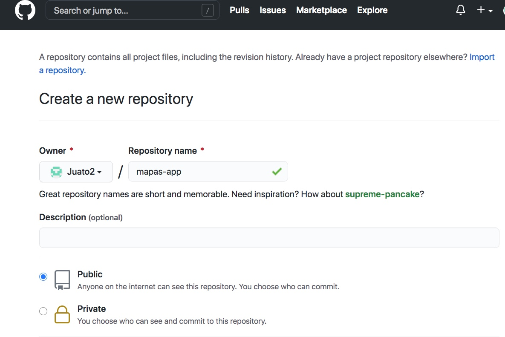
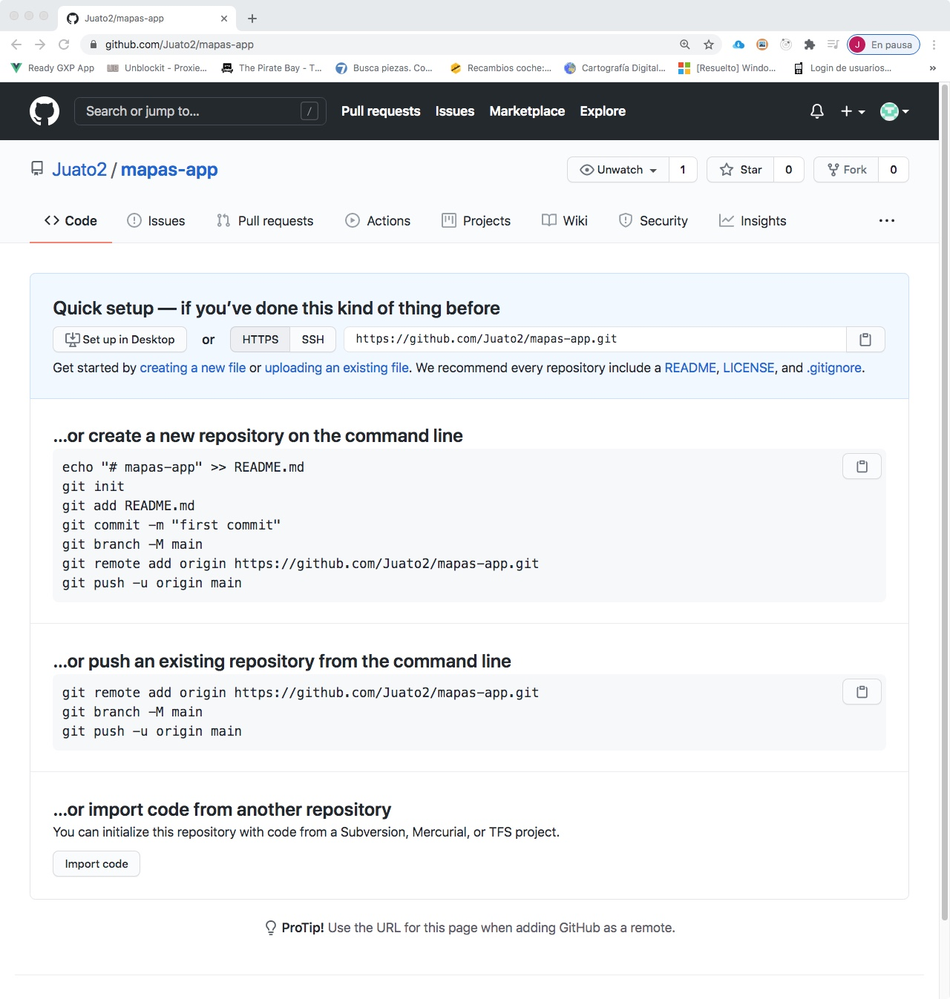

# MapasApp

This project was generated with [Angular CLI](https://github.com/angular/angular-cli) version 11.1.1.

## Development server

Run `ng serve` for a dev server. Navigate to `http://localhost:4200/`. The app will automatically reload if you change any of the source files.

## Code scaffolding

Run `ng generate component component-name` to generate a new component. You can also use `ng generate directive|pipe|service|class|guard|interface|enum|module`.

## Build

Run `ng build` to build the project. The build artifacts will be stored in the `dist/` directory. Use the `--prod` flag for a production build.

## Running unit tests

Run `ng test` to execute the unit tests via [Karma](https://karma-runner.github.io).

## Running end-to-end tests

Run `ng e2e` to execute the end-to-end tests via [Protractor](http://www.protractortest.org/).

## Further help

To get more help on the Angular CLI use `ng help` or go check out the [Angular CLI Overview and Command Reference](https://angular.io/cli) page.

# Empezando la AppMapas

## New

* Ejecutamos `ng new mapasApp` 


## Estructura
* Creamos las siguientes carpetas:


## Módulo y componentes

* Es hora de crear los primeros elementos con Angular CLI. Ejecutamos 

### Módulos

```shell
~/Documents/Angular/Proyectos/Angular (2021)/09-mapasApp on master*
$ ng g m mapas --routing
CREATE src/app/mapas/mapas-routing.module.ts (248 bytes)
CREATE src/app/mapas/mapas.module.ts (276 bytes)
```

### Componentes

```shell
~/Documents/Angular/Proyectos/Angular (2021)/09-mapasApp on master*
$ ng g c mapas/components/miniMapa --skipTests -s
Support for camel case arguments has been deprecated and will be removed in a future major version.
Use '--skip-tests' instead of '--skipTests'.
CREATE src/app/mapas/components/mini-mapa/mini-mapa.component.html (24 bytes)
CREATE src/app/mapas/components/mini-mapa/mini-mapa.component.ts (259 bytes)
UPDATE src/app/mapas/mapas.module.ts (373 bytes)
```

```shell
~/Documents/Angular/Proyectos/Angular (2021)/09-mapasApp on master*
$ ng g c mapas/pages/fullScreen --skip-tests -s
CREATE src/app/mapas/pages/full-screen/full-screen.component.html (26 bytes)
CREATE src/app/mapas/pages/full-screen/full-screen.component.ts (265 bytes)
UPDATE src/app/mapas/mapas.module.ts (475 bytes)
```

```shell
~/Documents/Angular/Proyectos/Angular (2021)/09-mapasApp on master*
$ ng g c mapas/pages/marcadores --skip-tests -s
CREATE src/app/mapas/pages/marcadores/marcadores.component.html (25 bytes)
CREATE src/app/mapas/pages/marcadores/marcadores.component.ts (263 bytes)
UPDATE src/app/mapas/mapas.module.ts (575 bytes)
```

```shell
~/Documents/Angular/Proyectos/Angular (2021)/09-mapasApp on master*
$ ng g c mapas/pages/zoomRange --skip-tests -s
CREATE src/app/mapas/pages/zoom-range/zoom-range.component.html (25 bytes)
CREATE src/app/mapas/pages/zoom-range/zoom-range.component.ts (262 bytes)
UPDATE src/app/mapas/mapas.module.ts (673 bytes)
```

```shell
~/Documents/Angular/Proyectos/Angular (2021)/09-mapasApp on master*
$ ng g c mapas/pages/propiedades --skip-tests -s
CREATE src/app/mapas/pages/propiedades/propiedades.component.html (26 bytes)
CREATE src/app/mapas/pages/propiedades/propiedades.component.ts (266 bytes)
UPDATE src/app/mapas/mapas.module.ts (777 bytes)
```

```shell
~/Documents/Angular/Proyectos/Angular (2021)/09-mapasApp on master*
$ ng g c shared/menu --skip-tests -s
CREATE src/app/shared/menu/menu.component.html (19 bytes)
CREATE src/app/shared/menu/menu.component.ts (245 bytes)
UPDATE src/app/app.module.ts (474 bytes)
```

# GitHub

## Estructura
* Creamos un nuevo repositorio con el botón `new`:


## Propiedades
* Configuramos sus propiedades:



## Comandos Git
* Nos muestra los comandos que debemos de usar para empezar:



…or create a new repository on the command line

```Shell
echo "# mapas-app" >> README.md
git init
git add README.md
git commit -m "first commit"
git branch -M main
git remote add origin https://github.com/Juato2/mapas-app.git
git push -u origin main
```

…or push an existing repository from the command line

```Shell
git remote add origin https://github.com/Juato2/mapas-app.git
git branch -M main
git push -u origin main
```
